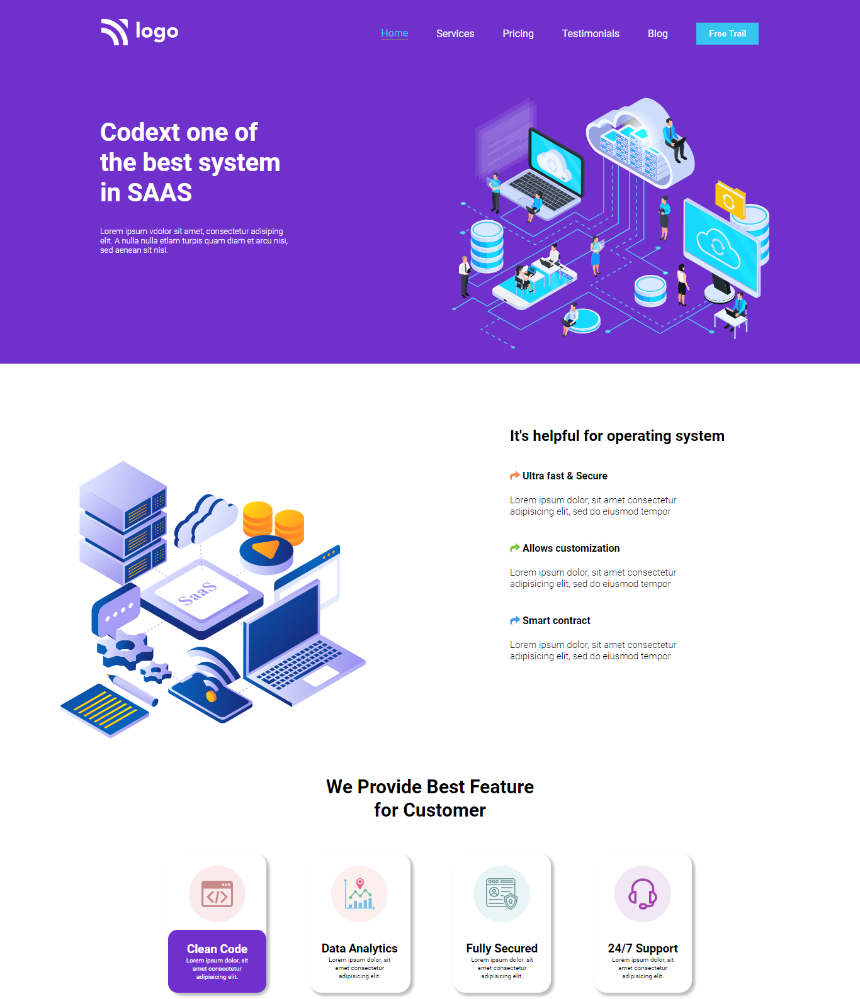
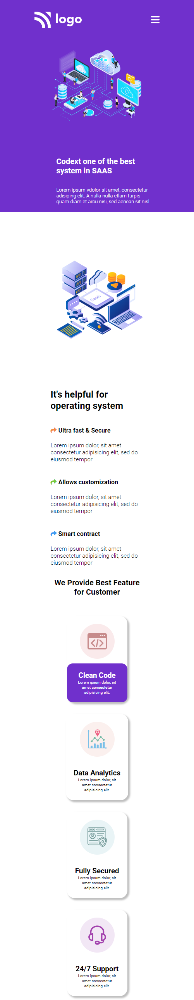

# SAAS Landing Page

  

This is a Business Landing web page design made using HTML and CSS only. It is responsive as well. Please check it out. 
***
### Name: SOURITA RAY
***
## Demo

## Mobile Layout

## What have I learnt in this project?

In this project I have got hands on experience on
- CSS positions
- CSS Selectors
- Media queries
- In depth knowledge on flex-box
- Box shadow property in CSS

## Time required to complete the project

Approximately 5 to 6 hours.

## Live Link

[Business Landing Page](https://business-landing-page-souritaray.netlify.app/)

## Contact me on:

- [Linked In-Sourita Ray](www.linkedin.com/in/sourita-ray-89bab0212)
- [Email-id Sourita Ray](souritaray@gmail.com)

## Feedback

You can provide your feedback at souritaray@gmail.com

